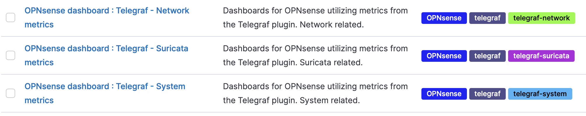

# OPNsense Telegraf Kibana Dashboards

Here are dashboards for Kibana from the Elastic Stack, which you can use to visualize the different outputs from the Telegraf plugin in OPNsense.

## Prerequisites

OPNsense
- OPNsense 21.7.7-amd64
- os-telegraf 1.12.3

Elastic Stack:
- kibana 7.16.0
- elasticsearch 7.16.0

## Installation
### Configure Elasticsearch
Create a user with Role permissions to create Indicies in Elasticsearch. You can do this through Kibana. 

#### Role
Role name:
- opnsense_telegraf_write

Cluster privileges:
- manage_index_templates
- manage_ilm
- monitor

Under Index privileges add Indicies as custom option:
- telegraf*

With these Privileges: 
- all
*- write*
*- delete*
*- manage*
*- manage_ilm*
*- create_index*
*- auto_configure*

#### User
Add a user with the role `opnsense_telegraf_write`. Note the password, you will use it in OPNsense. 

#### elasticsearch.yml
Remember to change `network.host` in `elasticsearch.yml` to an appropriate value to allow external connections. 

### Configure Telegraf
Configure Telegraf in OPNsense to output to Elasticsearch. OPNSense > Services > Telegraf > Output. 

### Configure Kibana
Depending on what you have used for Index Name in OPNsense, create Index patterns in Kibana (Stack Management > Kibana > Index Patterns > "Create index pattern") and match it:
- telegraf-*

Use `start_time` as Timestamp field. Select Create index pattern. 

Import the dashboards through Kibana (Stack Management > Kibana > Saved Objects > "Import")

- dashboards/opnsense-dashboard-telegraf-network-7.16.0.ndjson
- dashboards/opnsense-dashboard-telegraf-suricata-7.16.0.ndjson
- dashboards/opnsense-dashboard-telegraf-system-7.16.0.ndjson

After each consequent import, you'll notice you have some overwrites - but that is only the tags beiing overwritten.
After some time, your dashboards will start working. 

### Changelog
Trying to just smooth things over as I work with this.

## How to use it
Analytics > Dashboard 

## Contributing
There are many ways to contribute:
- Fix and [report bugs]
- Improve documentation

## Disclaimer
While I try to keep the information timely and accurate, I make no guarantees. I will make an effort to correct errors brought to my attention. Probably there are some logical errors already in the dashboards. 